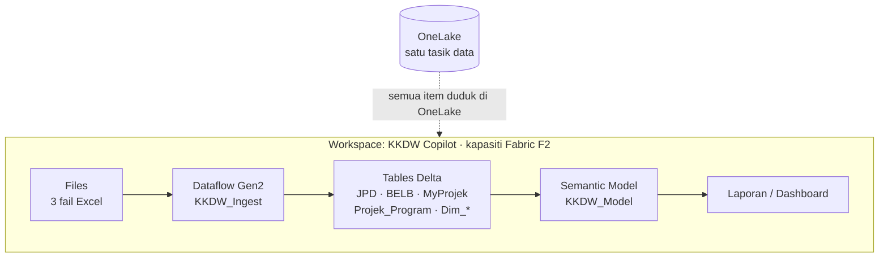

# Hari 1 — Fondasi Data: Microsoft Fabric, Power Query & Pemodelan

Panduan langkah demi langkah untuk **hari pertama** kursus *Visualisasi Data & Dashboard Pintar Berasaskan AI* (kod **BI-FABRIC-KKDW-101**), disediakan untuk **Kementerian Kemajuan Desa dan Wilayah (KKDW)**. Nota ini mengikut **aturcara rasmi SESI 1–5** — lihat [`../JADUAL.md`](../JADUAL.md).

Projek kursus: **KKDW Rural Infrastructure Intelligence Dashboard** — dashboard pengurusan yang memantau prestasi **JPD**, **BELB** dan **MyProjek**. Hari 1 membina **fondasi data** — tanpa data yang bersih dan bermodel, tiada dashboard boleh dipercayai.

> **Nota untuk pemula:** Anda **tidak perlu** tahu pengaturcaraan. Setiap konsep diterangkan perlahan — termasuk **kenapa** ia wujud, bukan sekadar cara guna. Kita sentiasa mula dengan *why*, kemudian *how*.

> **Konvensyen bahasa:** Penerangan dalam **Bahasa Melayu**; nama medan data (`kos_projek`, `status_pelaksanaan`), fungsi & istilah teknikal dikekalkan dalam **Bahasa Inggeris**.

> **Cara guna nota ini:** Bahagian di bawah menerangkan **konsep** setiap sesi. Latihan hands-on **langkah demi langkah** ada dalam [`snippets/lab.md`](./snippets/lab.md). Baca konsep dahulu, kemudian pindah ke lab.

---

## Fokus Hari Ini

Hari 1 ialah hari **menyediakan data** sebelum **memvisualkan**. Kita habiskan hari dengan satu **model data bersepadu** JPD + BELB + MyProjek. Rujukan rasmi setiap topik:

| Topik | Rujukan rasmi |
|-------|----------------|
| Power BI (umum) | [learn.microsoft.com/power-bi](https://learn.microsoft.com/power-bi/) |
| Microsoft Fabric | [learn.microsoft.com/fabric](https://learn.microsoft.com/fabric/) |
| Power Query | [learn.microsoft.com/power-query](https://learn.microsoft.com/power-query/) |
| Pemodelan data (star schema) | [learn.microsoft.com/power-bi/guidance/star-schema](https://learn.microsoft.com/power-bi/guidance/star-schema) |
| Muat turun Power BI Desktop | [powerbi.microsoft.com/desktop](https://powerbi.microsoft.com/desktop/) |

---

## Jadual Hari Ini — **Rabu (4.00 petang – 10.00 malam)**

Disalin daripada [`../JADUAL.md`](../JADUAL.md) — **HARI 1**. *(Blok petang–malam; sesi lebih padat berbanding sehari penuh.)*

| Masa | Agenda |
|------|--------|
| 4.00 – 4.15 petang | Pendaftaran Peserta & Taklimat Ringkas |
| **4.15 – 5.30 petang** | **SESI 1: Pengenalan — Ekosistem Data & Konteks KKDW** — Kenapa visualisasi · Power BI/Fabric/Copilot · Aliran kerja · JPD/BELB/MyProjek · 🧠 Bengkel soalan pengurusan |
| **5.30 – 7.00 petang** | **SESI 2: Microsoft Fabric & Menyambung Data** — OneLake, Workspace, Lakehouse · Import vs DirectQuery · 💻 Lab muat naik 3 set data |
| 7.00 – 8.00 malam | Rehat, Makan Malam & Solat Maghrib |
| **8.00 – 8.50 malam** | **SESI 3: Transformasi Data dengan Power Query** — Applied Steps · jenis data · null · standardkan medan · 💻 Lab bersihkan JPD & BELB |
| **8.50 – 9.25 malam** | **SESI 4: Integrasi & Penggabungan Data** — Merge vs Append · 💻 Latihan jadual projek bersepadu |
| **9.25 – 10.00 malam** | **SESI 5: Pemodelan Data** — Star schema · Date table · Relationships · 💻 Lab model bersepadu |
| 10.00 malam | Bersurai |

**Hasil Hari 1:** Model data bersepadu JPD + BELB + MyProjek yang bersih dan sedia untuk analisis.

> Hari ini **belum** menyentuh DAX kompleks, visual atau Copilot — semua itu Hari 2 & 3. Fokus: **data yang betul**.

---

## SESI 1 (4.15 – 5.30 petang) — Pengenalan: Ekosistem Data & Konteks KKDW

**Kenapa kita mula dengan konsep, bukan terus buka Power BI?** Kerana dashboard yang cantik tetapi dibina di atas data salah akan menyesatkan keputusan pengurusan. Sesi ini membina "peta mental" supaya setiap langkah teknikal sepanjang kursus masuk akal.

### Kenapa visualisasi data penting untuk KKDW

KKDW memantau **ribuan projek** luar bandar merentas negeri, daerah, parlimen dan kampung. Dalam bentuk jadual Excel mentah, mustahil untuk pengurusan nampak dengan pantas:

- Projek mana **lewat** atau **berisiko**?
- Negeri/kawasan mana perlu diberi **keutamaan**?
- Di mana **peruntukan** tinggi tetapi **kemajuan fizikal** rendah?

Dashboard menukar 1,376 baris JPD + 23 baris BELB + 77 projek MyProjek kepada **beberapa nombor & carta** yang menjawab soalan tersebut dalam beberapa saat.

### Landskap: Power BI, Microsoft Fabric & Copilot

Tiga alat, tiga peranan yang saling melengkapi:

```
Microsoft Fabric  →  Platform data bersepadu (simpan, sedia, transform, model data)
Power BI          →  Bina visual, dashboard & laporan interaktif di atas data itu
Copilot / AI      →  Pembantu pintar — tanya data dalam bahasa biasa, jana insight
```

**Analogi KKDW:** Fabric ialah **gudang & bilik sedia data** (semua data projek dikumpul, dibersih, disusun); Power BI ialah **bilik pameran** (papar prestasi dengan carta & peta); Copilot ialah **pegawai analisis maya** yang boleh ditanya "negeri mana belanja BELB tertinggi tetapi kemajuan terendah?".

### Aliran kerja kursus (fixed)

```
1) Data      — kumpul JPD, BELB, MyProjek
2) Fabric    — sedia, transform, integrasi & model data      (Hari 1)
3) Power BI  — KPI, visual, drill-down, peta, dashboard      (Hari 2)
4) Analitik  — Risk Score, Fizikal vs Kewangan, Priority     (Hari 3)
5) Copilot   — pertanyaan bahasa biasa, ringkasan eksekutif  (Hari 3)
```

### Set data KKDW yang kita guna

| Data | Isi | Baris |
|------|-----|-------|
| `data_jpd` | Projek Jalan Perhubungan Desa | 1,376 |
| `data_belb` | Projek Bekalan Elektrik Luar Bandar | 23 |
| `data_myprojek` | Pemantauan projek pembangunan (kos, peruntukan, belanja, kemajuan) | 77 |

> 🧠 **Bengkel SESI 1** ada dalam [Latihan 1, lab](./snippets/lab.md#latihan-1--bengkel-soalan-pengurusan) — anda senaraikan soalan pengurusan sebenar yang dashboard perlu jawab, dan padankan dengan medan data yang ada.

---

## SESI 2 (5.30 – 7.00 petang) — Microsoft Fabric & Menyambung Data

### Apa itu Microsoft Fabric?

Microsoft Fabric ialah **platform analitik bersepadu** — satu tempat untuk semua kerja data: simpanan, penyediaan, transformasi, pemodelan dan pelaporan. Power BI kini sebahagian daripada Fabric.

Istilah penting:

- **OneLake** — "OneDrive untuk data" — satu tasik data (data lake) untuk seluruh organisasi. Semua data KKDW boleh duduk di satu tempat.
- **Workspace** — ruang kerja berkumpulan tempat item (laporan, model, lakehouse) disimpan & dikongsi.
- **Lakehouse** — gabungan *data lake* + *data warehouse*: simpan fail mentah **dan** jadual berstruktur untuk analisis.
- **Dataflows Gen2** — Power Query di awan — transformasi data yang boleh dijadualkan & dikongsi.
- **Semantic Model** — model data (jadual + relationships + measures) yang jadi sumber laporan.

**Seni bina Fabric (cara data KKDW mengalir):**



> **Nota lesen:** Ciri penuh Fabric (& Copilot) perlukan **Fabric capacity (F64+)** atau tenant Copilot. Untuk kursus, sebahagian latihan boleh dijalankan **100% dalam Power BI Desktop** (percuma) jika akses Fabric belum sedia — sahkan dengan pentadbir IT KKDW.

### Import vs DirectQuery

Dua cara Power BI sambung ke data:

| | **Import** | **DirectQuery** |
|---|---|---|
| Data disimpan | Dalam fail `.pbix` (dalam memori) | Kekal di sumber; ditanya masa nyata |
| Kelajuan | Sangat pantas | Bergantung sumber |
| Saiz data | Sesuai kecil–sederhana | Sesuai data sangat besar |
| Untuk KKDW | **Pilihan kita** (data JPD/BELB/MyProjek kecil) | Untuk kemudian, data besar/langsung |

Kerana set data KKDW kecil, kita guna **Import** sepanjang kursus.

> **Mode ketiga — Direct Lake (khas Fabric).** Bila data KKDW nanti duduk dalam **Lakehouse/Warehouse OneLake**, ada mode **Direct Lake** yang memberi *kelajuan Import* **tanpa** perlu jadual refresh (sentiasa baca data terkini). Ia hanya wujud dalam Fabric — kita **tidak** guna dalam kursus (data kita kecil, Import memadai), tetapi baik untuk tahu arah tuju. Butiran: [`../nota/02-fabric-onelake.md`](../nota/02-fabric-onelake.md#direct-lake--mode-sambungan-ketiga-khas-fabric).

### Menyambung fail Excel

Power BI Desktop → **Get Data → Excel** → pilih fail set data kursus (JPD/BELB/MyProjek — disediakan semasa kelas) → pilih `Sheet1` → **Transform Data** (bukan *Load* terus — kita nak bersihkan dahulu di SESI 3).

> 💻 **Lab SESI 2:** [Latihan 2](./snippets/lab.md#latihan-2--muat-naik-3-set-data) — sambung ketiga-tiga fail JPD, BELB & MyProjek.

---

## SESI 3 (8.00 – 8.50 malam) — Transformasi Data dengan Power Query

### Kenapa perlu transform dahulu?

Data mentah jarang sedia untuk analisis: jenis data salah (nombor jadi teks), medan tak seragam ("Sabah" vs "SABAH"), lajur kosong, nilai `null`. **Power Query** membetulkan semua ini — dan yang penting, ia **merekod setiap langkah** ("Applied Steps") supaya boleh diulang automatik bila data dikemas kini.

### Konsep utama Power Query

- **Applied Steps** — senarai langkah transformasi di sebelah kanan; boleh undo/edit bila-bila.
- **Tukar jenis data (Data Type)** — pastikan `kos_projek` = *Decimal Number*, `tahun` = *Whole Number*, `peratus_sebenar_projek` = *Percentage/Decimal*.
- **Kendali null & buang lajur** — buang lajur yang tak digunakan (`created_at`, `updated_at`), ganti null dengan 0 pada medan kewangan bila sesuai.
- **Standardkan medan kunci** — seragamkan `negeri`, `daerah`, `status_pelaksanaan` (UPPERCASE / Trim) supaya padanan & tapisan tepat.
- **Conditional Column** — cipta lajur baru berdasarkan syarat, contoh kategori status ringkas:

```
JIKA status_pelaksanaan = "PASCA PELAKSANAAN"  → "Siap"
JIKA status_pelaksanaan = "DALAM PELAKSANAAN"  → "Dalam Pelaksanaan"
selainnya                                      → "Belum Mula / Lain"
```

> **Data sebenar:** dalam `data_jpd`, `status_pelaksanaan` = *PASCA PELAKSANAAN* (949) atau *DALAM PELAKSANAAN* (405). Kita akan seragamkan supaya visual status konsisten.

> 💻 **Lab SESI 3:** [Latihan 3](./snippets/lab.md#latihan-3--bersihkan-data-jpd--belb).

---

## SESI 4 (8.50 – 9.25 malam) — Integrasi & Penggabungan Data

Data KKDW datang dalam **tiga fail berasingan**. Untuk analisis bersepadu, kita perlu gabungkan.

- **Append (susun baris)** — cantum baris jadual yang **struktur sama** (contoh: gabung projek JPD & BELB ke satu jadual "Projek" dengan lajur `program` = JPD/BELB).
- **Merge (gabung lajur)** — bawa lajur dari satu jadual ke jadual lain berdasarkan **kunci padanan** (contoh: `kod_projek`) — seperti VLOOKUP tetapi lebih berkuasa.

**Untuk KKDW:** kita *Append* JPD + BELB menjadi jadual operasi program, dan gunakan `kod_projek`/medan lokasi untuk kaitkan dengan maklumat kewangan MyProjek. Hasilnya: satu pandangan projek yang boleh ditapis mengikut program, negeri dan status.

> 💻 **Lab SESI 4:** [Latihan 4](./snippets/lab.md#latihan-4--gabung-jpd--belb).

---

## SESI 5 (9.25 – 10.00 malam) — Pemodelan Data (Data Modeling)

### Kenapa model, bukan satu jadual besar?

Menyusun semua ke **satu jadual raksasa** menyebabkan pertindihan data, saiz besar & pengiraan perlahan. Penyelesaian industri: **Star Schema**.

### Star Schema — Fakta vs Dimensi

```
                 ┌─────────────┐
                 │  Dim_Negeri │
                 └──────┬──────┘
   ┌─────────────┐      │      ┌─────────────┐
   │  Dim_Status │──┐   │   ┌──│  Dim_Tarikh │
   └─────────────┘  ▼   ▼   ▼  └─────────────┘
                 ┌──────────────┐
                 │  Fakta_Projek │  ← kos, peruntukan, belanja, % kemajuan
                 └──────────────┘
```

- **Jadual Fakta** — data berangka yang diukur: `kos_projek`, `kos_keseluruhan`, `belanja`, `baki`, `peratus_sebenar_projek`. Satu baris = satu projek.
- **Jadual Dimensi** — konteks untuk menapis/kumpul: **Negeri, Daerah, Agensi, Status, Tarikh (Date table)**.
- **Relationships** — sambungkan Fakta ke Dimensi (biasanya *one-to-many*: satu negeri → banyak projek).

### Date table (wajib)

Buat jadual kalendar khusus supaya analisis mengikut tahun/tempoh (dan fungsi *Time Intelligence* DAX Hari 2) berfungsi betul — berdasarkan `tahun_jangka_mula` / `tahun_jangka_siap`.

### Amalan terbaik

- Nama medan jelas & konsisten; sembunyikan lajur teknikal (`id`, kunci) daripada paparan.
- Elak relationship *many-to-many* melainkan perlu.
- Satu Date table aktif untuk seluruh model.

> 💻 **Lab SESI 5:** [Latihan 5](./snippets/lab.md#latihan-5--bina-model-bersepadu) — bina relationships & Date table → **simpan `hari-1.pbix`** (deliverable Hari 1).

---

## Rumusan Hari 1

Anda kini ada **model data bersepadu** JPD + BELB + MyProjek — bersih, bertaip betul, dan berstruktur star schema dengan Date table. Esok (Hari 2) kita hidupkan data ini dengan **DAX, visual & dashboard**.

**Semak sebelum balik:**
- [ ] Ketiga-tiga set data dimuat & dibersihkan dalam Power Query
- [ ] Medan `negeri`, `status_pelaksanaan`, kewangan bertaip betul
- [ ] Jadual dimensi + Date table wujud
- [ ] Relationships dibina (star schema)
- [ ] Fail disimpan sebagai `hari-1.pbix`

➡️ **Hari 2 & 3** (DAX, visualisasi, dashboard, Copilot/AI) diteruskan semasa kelas — tidak disertakan dalam repo awam ini.
