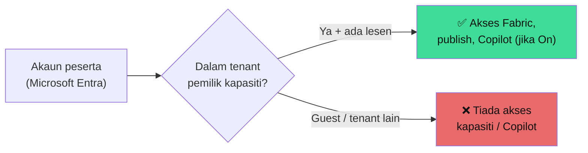
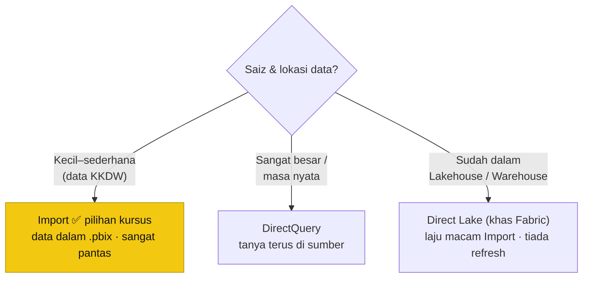
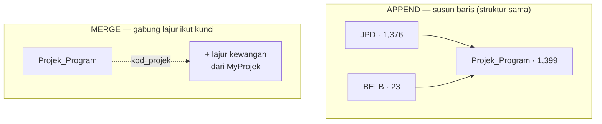
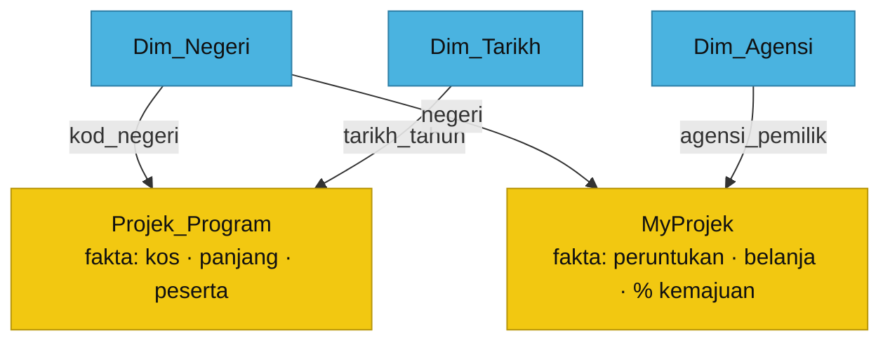

# Hari 1 — Lab Hands-On (SESI 1–5)

Latihan langkah demi langkah untuk membina **model data bersepadu** JPD + BELB + MyProjek. Fail data (JPD/BELB/MyProjek) **disediakan semasa kelas** — *tidak disertakan dalam repo awam ini*.

> 📎 **Rujukan kod:** [`power-query.m`](./power-query.m) — kod M untuk bersih & gabung data (tampal dalam Advanced Editor, atau ikut GUI di bawah).

> **Peringatan:** kita **belum** bina visual hari ini — fokus data yang **bersih & bermodel**.

### Aliran Hari 1 (gambaran keseluruhan)


## Dua laluan — **pelayar (wajib) + Desktop (pilihan)**

**Laluan A (pelayar) ialah tulang belakang untuk semua** — ia **satu-satunya** tempat untuk **Fabric & Copilot**, dan boleh laksana keseluruhan kursus (Hari 1–3). **Laluan B (Desktop)** cuma alat tambahan untuk authoring Hari 2–3 (Windows), **bukan** ganti Fabric/Copilot.

| | **Laluan A — Fabric (pelayar) · WAJIB** | **Laluan B — Power BI Desktop · PILIHAN** |
|---|---|---|
| Peranan | Tulang belakang: **Fabric + Copilot + semua Hari 1–3** | Authoring laporan/DAX lebih kaya (Hari 2–3) |
| Alat | Microsoft Fabric di **pelayar** (OneLake, Lakehouse, Dataflow Gen2, Service, Copilot) | Power BI **Desktop** (aplikasi) |
| OS | **Mana-mana** (termasuk macOS) | **Windows sahaja** |
| Fabric & Copilot? | ✅ **Ya — hanya di sini** | ❌ Tidak (tak boleh cipta Lakehouse/Dataflow; Copilot Fabric di pelayar) |
| Simpan hasil | Jadual Delta + **semantic model** dalam workspace | fail `hari-1.pbix` |

> ⚠️ **Peserta yang guna Desktop sahaja akan terlepas Fabric & Copilot** (objektif teras kursus). **Setiap peserta perlu Laluan A (pelayar).** Di macOS, guna Power BI **Service** (pelayar) untuk authoring Hari 2–3 — bukan Desktop.

---

## Latihan 0 — Persediaan (Setup)

**Tujuan:** pastikan alat sedia sebelum mula. Pilih laluan ikut komputer anda.

### Laluan A — Fabric (pelayar) · mana-mana OS (termasuk macOS)

1. Buka pelayar → **`app.fabric.microsoft.com`** → **Sign in** dengan akaun organisasi KKDW.
2. Pilih (atau minta pentadbir cipta) **Workspace** jenis Fabric pada kapasiti **F2+** — kursus guna workspace **KKDW Copilot**.
3. Sahkan anda nampak **New item → Lakehouse / Dataflow Gen2** dalam workspace.
4. *(Copilot — Hari 3)* sahkan tetapan tenant Copilot **On** — rujuk panduan pentadbir Fabric (disediakan semasa kelas).

### Laluan B — Power BI Desktop · Windows sahaja

1. Pasang **Power BI Desktop** — **Microsoft Store** (cari "Power BI Desktop") atau [powerbi.microsoft.com/desktop](https://powerbi.microsoft.com/desktop/). *Percuma.*
2. Buka → **Sign in** (kanan atas) dengan akaun organisasi KKDW.
3. Sahkan **Home → Get Data** berfungsi.

> **macOS tiada Power BI Desktop** — guna **Laluan A**, atau **Power BI Service** (pelayar) untuk laporan Hari 2–3.

### Sahkan kapasiti Fabric (= kapasiti Azure)

Kapasiti Fabric ialah **sumber Azure** (`Microsoft.Fabric/capacities`) — jadi "setup Fabric" dan "setup Azure" merujuk kapasiti yang sama. Sahkan langkah demi langkah:

1. Dalam workspace → **Workspace settings** (kanan atas).
2. Klik tab **Workspace type**.
3. Sahkan: **Current workspace type = Fabric**, **SKU: F2**, **Region: Malaysia West**.


4. *(Pentadbir)* Sahkan sumber di **Azure portal → Microsoft Fabric → Capacities**: status **Active**, **F2**, **Malaysia West**. *(Nama kapasiti & Capacity ID disunting dalam gambar untuk privasi.)*

> Dalam kelas ini, `az` mengesahkan kapasiti: **SKU F2 · tier Fabric · region malaysiawest** — sepadan dengan skrin di atas.

### Identiti & lesen (Microsoft Entra)

Fabric, Power BI & Copilot semua log masuk melalui **Microsoft Entra ID** (dahulu **Azure AD**) — lapisan identiti/tenant organisasi.

1. **Log masuk dengan akaun dalam tenant yang sama** dengan pemilik workspace. Akaun **guest / tenant lain** selalu gagal akses kapasiti atau Copilot.
2. **Lesen:** setiap peserta perlu lesen **Power BI (Pro/PPU)** untuk **publish & kongsi** (Hari 2). Kapasiti **Fabric F2+** menampung item Fabric.
3. **Copilot:** perlu kapasiti **F2+** **DAN** pentadbir tenant dayakan di **Admin portal → Copilot and AI**.

> Peserta biasa **tidak** perlu peranan admin — hanya **akaun tenant + lesen**. Tetapan tenant/Copilot & umpukan lesen dibuat sekali oleh **pentadbir IT KKDW**.



### Nota lesen (penting)

- **Fabric penuh + Copilot** perlukan kapasiti **F2+ berbayar** (trial **tidak** termasuk Copilot). Sahkan dengan **pentadbir IT KKDW** sebelum kelas.
- Jika akses Fabric belum sedia, Hari 1 masih boleh 100% dalam **Power BI Desktop** (Windows).

✅ **Semak:** anda boleh log masuk + buka workspace Fabric (Laluan A) **atau** Power BI Desktop (Laluan B), dan kapasiti = **Fabric F2, Malaysia West**.

---

## Latihan 1 — Bengkel Soalan Pengurusan

**Tujuan:** faham *kenapa* sebelum *bina*.

1. Dalam kumpulan kecil, senaraikan **5 soalan** yang pengurusan KKDW mahu dashboard jawab. Contoh:
   - Berapa jumlah projek JPD & BELB, dan berapa yang lewat?
   - Negeri mana paling banyak peruntukan tetapi kemajuan rendah?
2. Untuk setiap soalan, padankan dengan **medan data** yang ada:

| Soalan | Data | Medan |
|--------|------|-------|
| Berapa projek lewat? | MyProjek | `peratus_jadual_projek`, `peratus_sebenar_projek` *(skala 0–100)* |
| Peruntukan vs belanja? | MyProjek | `peruntukan_disemak_janm_tahun_1..5`, `belanja_janm_tahun_1..5` |
| Kos jalan ikut negeri? | JPD | `kos_projek`, `panjang_jalan`, `kod_negeri` |

3. Simpan senarai — ia jadi **panduan** bila kita bina dashboard Hari 2.

---

## Latihan 2 — Muat Naik 3 Set Data

**Mode sambungan — Import vs DirectQuery vs Direct Lake** (kursus guna **Import**):



### Laluan A — Fabric (pelayar) · *ikut tangkapan skrin 01–09*

1. Buka **Fabric** → workspace **KKDW Copilot** *(skrin 01)*.
2. **New item → Lakehouse** → nama `KKDW_Lakehouse` *(skrin 02–03)*.
3. **Get data / Upload** 3 fail Excel (`data_jpd.xlsx`, `data_belb.xlsx`, `data_myprojek.xlsx`) ke **Files** *(skrin 04)*.
4. **New Dataflow Gen2** (`KKDW_Ingest`) → **Get data → Excel** → **Browse OneDrive/OneLake** → pilih setiap fail *(skrin 05–07)*.
5. Dalam Power Query Online, **rename** setiap query: `JPD`, `BELB`, `MyProjek` *(skrin 08–09)*.

### Laluan B — Power BI Desktop

1. Buka **Power BI Desktop** → log masuk akaun organisasi KKDW.
2. **Home → Get Data → Excel workbook** → pilih `data_jpd.xlsx`.
3. Dalam Navigator, tanda `Sheet1` → klik **Transform Data** (jangan *Load* terus).
4. Ulang untuk `data_belb.xlsx` dan `data_myprojek.xlsx` → rename `JPD`, `BELB`, `MyProjek`.

✅ **Semak:** tiga query kelihatan di panel *Queries*.

---

## Latihan 3 — Bersihkan Data JPD & BELB (Power Query)

Sama untuk kedua-dua laluan (Power Query Online atau Desktop). Untuk query **JPD**:

1. **Naikkan header betul:** pastikan baris tajuk sebenar dinaikkan (**Use First Row as Headers**). *Punca #1 ralat "Changed column type" ialah header salah dinaikkan.*
2. **Buang lajur tak perlu:** `created_at`, `updated_at`, `tarikh_upload` → klik kanan → **Remove Columns**.
3. **Betulkan jenis data:**
   - `kos_projek`, `panjang_jalan` → **Whole/Decimal Number**
   - `tahun`, `tahun_mula` → **Whole Number**
   - `kod_projek`, `kod_negeri`, `kod_daerah`, `kod_parlimen`, `kod_dun` → **Text** *(kekalkan sebagai teks — kod dengan sifar di hadapan akan rosak jika jadi nombor)*
4. **Standardkan teks:** pilih `kod_negeri`, `status_pelaksanaan` → **Transform → Format → UPPERCASE** + **Trim**.
5. **Conditional Column** `kategori_status` (**Add Column → Conditional Column**):
   - JIKA `status_pelaksanaan` = `PASCA PELAKSANAAN` → `Siap`
   - JIKA `status_pelaksanaan` = `DALAM PELAKSANAAN` → `Dalam Pelaksanaan`
   - Selainnya → `Belum Mula / Lain`

   ```mermaid
   flowchart LR
       S["status_pelaksanaan"] --> C{"Nilai?"}
       C -->|"PASCA PELAKSANAAN"| A["Siap"]
       C -->|"DALAM PELAKSANAAN"| B["Dalam Pelaksanaan"]
       C -->|"lain-lain"| D["Belum Mula / Lain"]
   ```

6. Ulang langkah 1–5 untuk query **BELB**.

✅ **Semak:** panel *Applied Steps* menunjukkan setiap langkah; `kategori_status` betul (JPD+BELB: Siap 952 · Dalam Pelaksanaan 425).

> **Nota data sebenar:** `lat_1/long_1/lat_2/long_2` wujud tetapi **kosong** dalam sumber — jadi peta Hari 2 ikut **negeri** (bukan titik koordinat).

---

## Latihan 4 — Gabung JPD & BELB → `Projek_Program`

**Tujuan:** satu jadual operasi program (JPD ∪ BELB) untuk KPI gabungan.



1. Dalam **JPD**, tambah **Custom Column** `program` = `"JPD"`. Dalam **BELB**, `program` = `"BELB"`.
2. Pastikan kedua-dua query kongsi lajur sepunya: `program`, `kod_projek`, `nama_projek`, `kos_projek`, `jumlah_projek_peserta`, `kod_negeri`, `status_pelaksanaan`, `kategori_status`, `tahun` (JPD tambah `panjang_jalan`; BELB tambah `nama_kampung`).
3. **Home → Append Queries → Append Queries as New** → pilih `JPD` + `BELB` → namakan hasil **`Projek_Program`**.
4. *(Untuk time-intelligence)* tambah lajur tarikh `tarikh_tahun` = awal tahun bagi `tahun` (mis. `#date([tahun],1,1)`).

✅ **Semak:** `Projek_Program` = **1,399 baris** (JPD 1,376 + BELB 23) dengan lajur `program`.

> **Laluan A (Fabric):** set **Data destination = `KKDW_Lakehouse`** bagi setiap query → **Publish/Refresh** dataflow. Jadual terbentuk dalam `KKDW_Lakehouse/Tables/dbo/`.
> **Laluan B (Desktop):** klik **Close & Apply** untuk muat ke model.

---

## Latihan 5 — Bina Model Bersepadu (star schema)

**Tujuan:** star schema + Date table + relationships. *(Inilah struktur `KKDW_Model` yang dibina untuk kelas.)*



*Dimensi (biru) → Fakta (emas), hubungan **many-to-one**, penapis **single**.*

1. **Jadual dimensi:**
   - **`Dim_Negeri`** — senarai negeri unik (gabungan `kod_negeri` JPD/BELB + `negeri` MyProjek, dinormalkan; mis. `N.SEMBILAN` → `NEGERI SEMBILAN`). 16 negeri.
   - **`Dim_Tarikh`** — Date table 2017–2028. Dalam Desktop: **Modeling → New Table** →
     ```dax
     Dim_Tarikh = CALENDAR ( DATE ( 2017, 1, 1 ), DATE ( 2028, 12, 31 ) )
     ```
     Tambah `Tahun = YEAR ( Dim_Tarikh[Date] )` → **Mark as Date Table**.
   - **`Dim_Agensi`** — senarai agensi unik dari `agensi_pemilik` / `agensi_pelaksana_utama` (MyProjek). 15 agensi.
2. **Relationships** (View → **Model**), semua *many-to-one*, penapis *single*:
   - `Projek_Program[kod_negeri]` → `Dim_Negeri[kod_negeri]`
   - `MyProjek[negeri]` → `Dim_Negeri[kod_negeri]`
   - `MyProjek[agensi_pemilik]` → `Dim_Agensi[agensi]`
   - `Projek_Program[tarikh_tahun]` → `Dim_Tarikh[Date]`
3. **Kemas paparan:** sembunyikan lajur teknikal (`id`, kunci) — klik kanan → *Hide*.

✅ **Semak & simpan:**
- [ ] `Dim_Tarikh` ditanda sebagai Date Table
- [ ] 4 relationships kelihatan sebagai garisan dalam Model view
- [ ] **Laluan A:** semantic model `KKDW_Model` wujud dalam workspace · **Laluan B:** **File → Save As → `hari-1.pbix`**

> **Hasil sebenar kelas:** model DirectLake **`KKDW_Model`** (7 jadual, 4 relationships, 23 measures) telah dibina & diuji — mis. `Jumlah Projek` = 1,399, `% Utilisasi` ≈ 80.5%. Measures dibina Hari 2 (diteruskan semasa kelas).

---

## Cabaran (jika ada masa)

Bina **Conditional Column** kedua dalam MyProjek: `bendera_ketidakpadanan` = `"Semak"` jika `belanja` tinggi tetapi `peratus_sebenar_projek` rendah (ingat: skala **0–100**) — kita akan guna idea ini pada Hari 3 (Risk Score & Early Warning).

---

## 📘 Rujukan Buku

*Architecting Power BI Solutions in Microsoft Fabric* (Packt) — bacaan lanjut bagi topik Hari 1:

| Latihan / topik | Bab & muka surat |
|---|---|
| SESI 2 · Fabric, OneLake, **Lakehouse** | Bab 7 *Understanding Microsoft Fabric* (ms 125–153) — Lakehouse **ms 136**, Warehouse ms 141 |
| SESI 2 · **Import vs DirectQuery vs Direct Lake** | Bab 5 *Deciding on the Storage Mode* (ms 75–106); Direct Lake **ms 146–148** |
| SESI 3 · Power Query (transform, query folding) | Bab 9 *Performing Optimizations in Power BI* — query folding **ms 206** |
| SESI 5 · Pemodelan (calc column vs measure) | Bab 9 — calculated column vs measure **ms 210** |

> Nota konsep berkaitan: [`../../nota/02-fabric-onelake.md`](../../nota/02-fabric-onelake.md) · [`../../nota/04-pemodelan-star-schema.md`](../../nota/04-pemodelan-star-schema.md).
