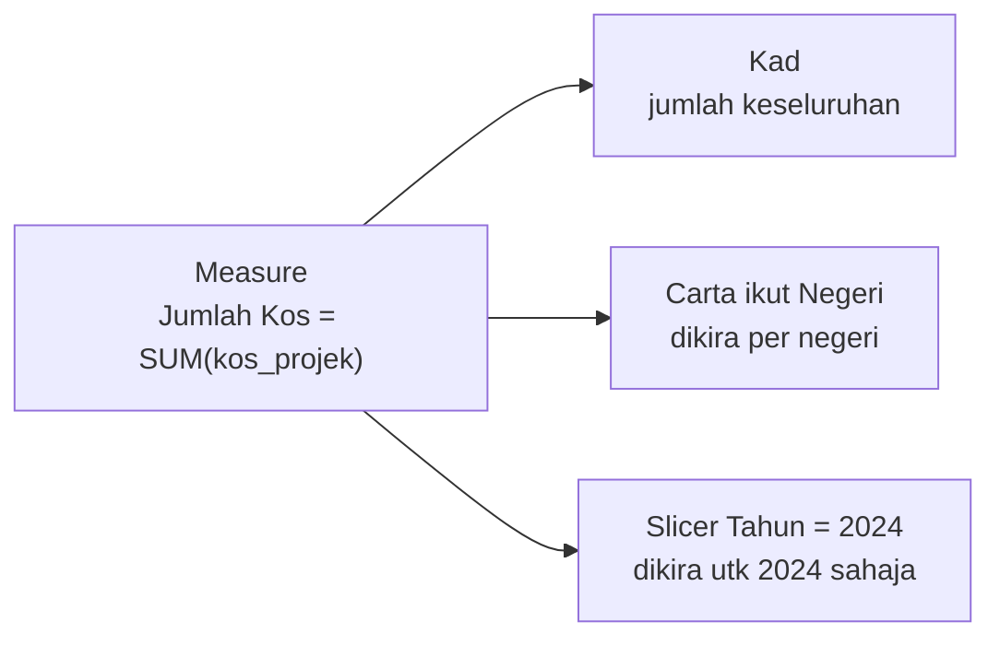
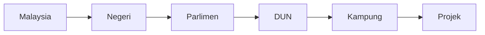
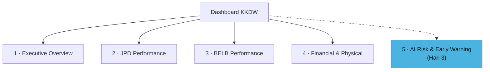

# Hari 2 — Power BI: DAX, Visualisasi & Pembinaan Dashboard

Panduan **hari kedua** kursus *Visualisasi Data & Dashboard Pintar Berasaskan AI* (kod **BI-FABRIC-KKDW-101**) untuk **KKDW**. Nota ini mengikut **aturcara rasmi SESI 6–10** — lihat [`../JADUAL.md`](../JADUAL.md).

Semalam kita bina **model data bersepadu** (`hari-1.pbix`). Hari ini kita hidupkannya: kira **KPI dengan DAX**, bina **visual & drill-down**, susun **4 halaman dashboard**, dan **terbitkan** ke Power BI Service.

> **Konvensyen bahasa:** Penerangan dalam **Bahasa Melayu**; fungsi DAX & medan data dalam **Bahasa Inggeris**.

> **Cara guna nota ini:** Konsep di bawah; lab hands-on (termasuk DAX salin-tampal) dalam [`snippets/lab.md`](./snippets/lab.md).

---

## Fokus Hari Ini

| Topik | Rujukan rasmi |
|-------|----------------|
| DAX | [learn.microsoft.com/dax](https://learn.microsoft.com/dax/) |
| Visualisasi Power BI | [learn.microsoft.com/power-bi/visuals](https://learn.microsoft.com/power-bi/visuals/) |
| Drill-through & drill-down | [learn.microsoft.com/power-bi/create-reports/desktop-drillthrough](https://learn.microsoft.com/power-bi/create-reports/desktop-drillthrough) |
| Peta (Maps) | [learn.microsoft.com/power-bi/visuals/power-bi-map-tips-and-tricks](https://learn.microsoft.com/power-bi/visuals/power-bi-map-tips-and-tricks) |
| Publish & Power BI Service | [learn.microsoft.com/power-bi/fundamentals/service-basic-concepts](https://learn.microsoft.com/power-bi/fundamentals/service-basic-concepts) |
| Row-Level Security | [learn.microsoft.com/power-bi/enterprise/service-admin-rls](https://learn.microsoft.com/power-bi/enterprise/service-admin-rls) |

## Jadual Hari Ini — **Khamis (8.30 pagi – 6.00 petang)**

*(Hari paling panjang — teras pembinaan dashboard.)*

| Masa | Agenda |
|------|--------|
| 8.30 – 9.00 pagi | Pendaftaran & Minum Pagi |
| **9.00 – 10.45 pagi** | **SESI 6: Pengiraan dengan DAX** — Measure vs Calculated Column · Filter Context · CALCULATE/FILTER/IF/SWITCH · KPI KKDW · 💻 Lab 8 measure teras |
| 10.45 – 11.00 pagi | Rehat |
| **11.00 – 1.00 tgh** | **SESI 7: Visualisasi Berkesan** — pilih visual betul · reka bentuk · Conditional Formatting · 💻 Lab visual JPD/BELB |
| 1.00 – 2.30 petang | Rehat, Makan Tengah Hari & Solat Zohor |
| **2.30 – 4.00 petang** | **SESI 8: Interaktiviti, Drill-Down & Peta** — Slicer · drill-down/through · hierarki lokasi · peta · 💻 Lab navigasi & peta |
| 4.00 – 4.15 petang | Rehat |
| **4.15 – 5.15 petang** | **SESI 9: Membina Dashboard Bersepadu** — 4 halaman · 💻 Lab dashboard |
| **5.15 – 6.00 petang** | **SESI 10: Menerbit & Berkongsi** — Publish · Refresh · RLS |
| 6.00 petang | Bersurai |

**Hasil Hari 2:** Dashboard 4 halaman (Executive, JPD, BELB, Financial), interaktif dengan drill-down & peta, diterbitkan ke Power BI Service.

---

## SESI 6 (9.00 – 10.45 pagi) — Pengiraan dengan DAX

### Apa itu DAX?

**DAX (Data Analysis Expressions)** ialah bahasa formula Power BI — seperti formula Excel, tetapi bekerja atas **jadual & relationships**, bukan sel. DAX menjawab soalan seperti "jumlah peruntukan mengikut negeri" tanpa menulis formula berulang.

### Measure vs Calculated Column — beza penting

| | **Calculated Column** | **Measure** |
|---|---|---|
| Dikira | Baris demi baris, disimpan dalam jadual | Masa nyata, ikut konteks visual |
| Guna memori | Ya (disimpan) | Tidak (dikira atas permintaan) |
| Contoh | Kategori status per projek | Jumlah Peruntukan, % Utilisasi |
| Amalan | Guna bila perlu nilai per-baris | **Utamakan measure** untuk KPI |

### Filter Context (ringkas)

Nilai measure **berubah ikut konteks** visual. Measure `Jumlah Kos` menunjukkan jumlah keseluruhan pada kad, tetapi bila diletak dalam carta "mengikut negeri", ia automatik dikira **per negeri**. Inilah kuasa DAX — satu measure, banyak konteks.



### Fungsi teras

- **Agregat:** `SUM`, `AVERAGE`, `COUNT`, `COUNTROWS`, `DISTINCTCOUNT`
- **Penapis & logik:** `CALCULATE` (ubah konteks penapis), `FILTER`, `IF`, `SWITCH`

### KPI teras KKDW (contoh)

```dax
Jumlah Projek = COUNTROWS ( Fakta_Projek )

Jumlah Peruntukan = SUM ( Fakta_Projek[peruntukan_disemak_janm] )

Jumlah Belanja = SUM ( Fakta_Projek[belanja_janm] )

Baki = [Jumlah Peruntukan] - [Jumlah Belanja]

% Utilisasi = DIVIDE ( [Jumlah Belanja], [Jumlah Peruntukan] )

Projek Siap =
CALCULATE ( [Jumlah Projek], Fakta_Projek[kategori_status] = "Siap" )
```

> Guna `DIVIDE(a, b)` bukan `a / b` — ia elak ralat bahagi-dengan-sifar.

> 💻 **Lab SESI 6:** [Latihan 6](./snippets/lab.md#latihan-6--8-measure-teras) — bina 8 measure teras.

---

## SESI 7 (11.00 – 1.00 tgh) — Visualisasi Data Berkesan

### Pilih visual yang betul

Bukan setiap data sesuai untuk setiap carta. Panduan ringkas:

| Nak tunjuk | Visual |
|------------|--------|
| Satu nombor penting (jumlah projek, peruntukan) | **Card / KPI** |
| Perbandingan antara kategori (projek ikut negeri) | **Bar / Column** |
| Trend ikut masa (belanja ikut tahun) | **Line** |
| Nilai berperingkat + drill (negeri→daerah) | **Matrix** |
| Bahagian daripada keseluruhan (status projek) | **Donut / Stacked** *(guna berhati-hati)* |
| Lokasi geografi | **Map** (SESI 8) |

### Prinsip reka bentuk dashboard pengurusan

- **Fokus:** nombor paling penting di atas-kiri (mata mula membaca di situ).
- **Kurangkan bunyi:** buang garis grid berlebihan, warna terlalu banyak, 3D.
- **Konsisten:** satu palet warna; warna status seragam (Hijau=Siap, Kuning=Risiko, Merah=Lewat).
- **Konteks:** setiap visual ada tajuk jelas & unit (RM, %, km).

### Conditional Formatting

Warnakan nilai secara automatik ikut syarat — contoh: sel `% Utilisasi` merah bila > 90% tetapi kemajuan fizikal rendah. Kita gunakan ini banyak pada Hari 3 untuk indikator risiko.

> 💻 **Lab SESI 7:** [Latihan 7](./snippets/lab.md#latihan-7--visual-jpd--belb).

---

## SESI 8 (2.30 – 4.00 petang) — Interaktiviti, Drill-Down & Peta

### Interaktiviti asas

- **Slicer** — penapis di atas halaman (contoh: pilih Negeri, Tahun, Program).
- **Cross-filtering** — klik satu bar → semua visual lain ditapis automatik.
- **Filters pane** — penapis peringkat visual/halaman/laporan.

### Drill-down & Drill-through — hierarki KKDW

Cadangan drill-down rasmi KKDW:



- **Drill-down** — dalam **satu visual**, klik turun peringkat hierarki (Negeri → Daerah → Kampung).
- **Drill-through** — klik kanan projek → lompat ke **halaman butiran** projek itu.

### Peta

Data JPD ada koordinat (`lat_1`, `long_1`) — sesuai untuk **Map** menunjukkan lokasi projek jalan. BELB & MyProjek boleh dipeta mengikut **Negeri/Daerah** (Filled Map).

> **Tip:** untuk peta ikut nama tempat, set *Data Category* medan (Modeling → Data Category → State/Province, City) supaya Power BI kenal lokasi dengan tepat.

> 💻 **Lab SESI 8:** [Latihan 8](./snippets/lab.md#latihan-8--drill-down--peta).

---

## SESI 9 (4.15 – 5.15 petang) — Membina Dashboard Bersepadu

Susun visual kepada **4 halaman** (struktur sasaran projek):

1. **Executive Overview** — Cards: jumlah projek JPD & BELB, jumlah peruntukan, projek siap/dalam pelaksanaan/lewat, purata kemajuan, bilangan negeri, projek berisiko tinggi.
2. **JPD Performance** — projek & kos ikut negeri (bar), status (donut), panjang jalan (KM siap vs dirancang), **kos per km**, peta lokasi.
3. **BELB Performance** — bilangan kampung terlibat, sambungan siap vs sasaran, **kos per sambungan**, % pencapaian ikut negeri.
4. **Financial & Physical Progress** — peruntukan vs belanja vs baki, **% utilisasi**, kemajuan fizikal vs kewangan (kesan ketidakpadanan).



> Halaman ke-5 **AI Project Risk & Early Warning** dibina esok (Hari 3).

> 💻 **Lab SESI 9:** [Latihan 9](./snippets/lab.md#latihan-9--4-halaman-dashboard) — **simpan `hari-2.pbix`**.

---

## SESI 10 (5.15 – 6.00 petang) — Menerbit & Berkongsi (Power BI Service)

- **Publish** — Home → Publish → pilih Workspace. Laporan naik ke **Power BI Service** (awan).
- **Report vs Dashboard vs App** — *Report* = halaman penuh interaktif; *Dashboard* = papan pin ringkasan (Service); *App* = pakej dikongsi kepada pengguna akhir.
- **Refresh** — jadualkan kemas kini data (Scheduled refresh) supaya dashboard sentiasa terkini.
- **Row-Level Security (RLS)** — hadkan data ikut pengguna (contoh: pegawai negeri Sabah nampak projek Sabah sahaja). Kita sentuh konsep ringkas; laksana penuh bergantung dasar KKDW.

> **Keselamatan data KKDW:** kongsi hanya kepada Workspace/pengguna yang dibenarkan; guna RLS untuk data sensitif; sahkan dasar residensi data dengan pentadbir IT.

---

## Rumusan Hari 2

Dashboard 4 halaman anda kini **berfungsi & diterbitkan**. Esok (Hari 3) kita tambah **kecerdasan**: analitik risiko, skor keutamaan, dan **Copilot/AI**.

**Semak sebelum balik:**
- [ ] 8 measure teras siap & betul
- [ ] 4 halaman dashboard lengkap
- [ ] Drill-down (Negeri→Daerah→Kampung) & peta berfungsi
- [ ] Slicer Negeri/Tahun/Program berfungsi merentas visual
- [ ] Laporan diterbit ke Power BI Service · disimpan `hari-2.pbix`

➡️ Seterusnya: **Hari 3 — Analitik, Copilot/AI & Capstone** *(diteruskan semasa kelas)*
