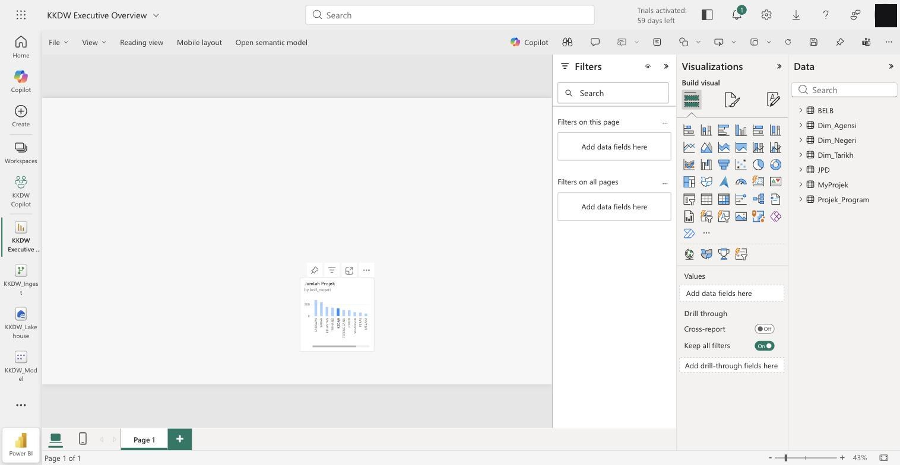
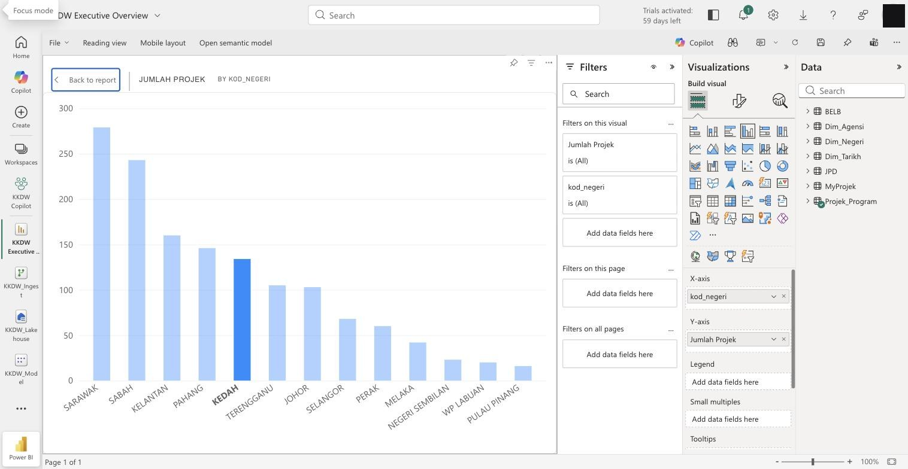

# Hari 2 — Lab Hands-On (SESI 6–10)

Latihan membina **KPI (DAX)**, **visual**, **drill-down & peta**, dan **4 halaman dashboard** — semua dalam **Power BI Service / Fabric (pelayar)** atas `KKDW_Model` (Hari 1). Perubahan **auto-simpan** dalam workspace (tiada fail `.pbix`).

> 📎 **Rujukan kod:** [`measures.dax`](./measures.dax) (semua measure teras + time intelligence) · [`calculated-columns.dax`](./calculated-columns.dax) (kategori_status, Urutan Status, jadual Kalendar).

> **Amalan penamaan measure:** letak semua measure dalam **satu jadual** (mis. `Projek_Program`) supaya mudah dicari. *(Nota: elak "Enter Data"/jadual kosong dalam model **DirectLake** — ia menukar mod jadual; letak measure pada jadual sedia ada.)*

---

## Latihan 6 — 8 Measure Teras

Buat setiap measure: dalam **Power BI Service** → buka **`KKDW_Model` → Open data model** → klik kanan jadual → **New measure**, tampal, tekan Enter. *(Sesuaikan nama jadual/medan ikut model anda.)*

**Tangkapan skrin — antaramuka penyunting laporan:** panel **Data** (7 jadual model `KKDW_Model`), galeri **Visualizations**, dan kanvas. *(Buat measure: Power BI Desktop → **Modeling → New measure**; Power BI Service → **Open semantic model → New measure**.)*



```dax
Jumlah Projek = COUNTROWS ( Projek_Program )
```
```dax
Jumlah Peruntukan = SUM ( MyProjek[peruntukan_disemak_janm_tahun_1] )
```
```dax
Jumlah Belanja = SUM ( MyProjek[belanja_janm_tahun_1] )
```

> ⚠️ **Jika anda buat Unpivot (Latihan 4C):** lajur `..._tahun_1` **sudah tiada** → dua measure di atas jadi **tak sah**. Gantikan dengan lajur *long*:
> ```dax
> Jumlah Peruntukan = SUM ( MyProjek[Peruntukan] )
> Jumlah Belanja    = SUM ( MyProjek[Belanja] )
> ```
> Versi long ini **jumlah semua tahun** (bukan Tahun 1 sahaja) & boleh ditapis ikut `Tahun`. **Tip:** buat Unpivot pada **Reference** (`MyProjek_Tahunan`) supaya `MyProjek` asal (wide) kekal untuk measure lain.

```dax
Baki = [Jumlah Peruntukan] - [Jumlah Belanja]
```
```dax
% Utilisasi = DIVIDE ( [Jumlah Belanja], [Jumlah Peruntukan] )
```
```dax
Projek Siap = CALCULATE ( [Jumlah Projek], Projek_Program[kategori_status] = "Siap" )
```
```dax
Projek Dalam Pelaksanaan = CALCULATE ( [Jumlah Projek], Projek_Program[kategori_status] = "Dalam Pelaksanaan" )
```
```dax
Purata Kemajuan Sebenar = AVERAGE ( MyProjek[peratus_sebenar_projek] )
```

✅ **Semak:** letak `Jumlah Projek` pada satu **Card** → nombor betul (contoh JPD+BELB ≈ 1,399).

> 💡 **Copilot boleh bantu jana measure** *(pecutan pilihan — sesi penuh Hari 3)*: dalam Power BI Service (Copilot-enabled) → **DAX query view → Copilot**, mis. *"Cipta measure Kos per KM = jumlah kos_projek ÷ jumlah panjang_jalan"*. Perlu **F64+/lesen Copilot**; **sahkan setiap baris DAX** (ingat skala 0–100). Set prompt Copilot penuh disediakan semasa kelas (Hari 3).

---

## Latihan 7 — Visual JPD & BELB

**Cipta laporan & cara tambah visual (Power BI Service, pelayar):**
- **a)** Dari **`KKDW_Model`** → klik **Create new report** *(atau Workspace → **New → Report** → pilih `KKDW_Model`)* → **report editor** terbuka dalam pelayar. *(Atau buka laporan sedia ada → **Edit**.)*
- **b) Tambah visual:** dalam panel **Visualizations** (kanan) klik ikon **jenis visual** (Card, Bar/Column chart, Donut…) → visual **kosong** muncul di kanvas. *(Atau seret medan dari panel **Data** terus ke kanvas — auto-cipta visual.)*
- **c) Isi medan:** dengan visual **dipilih**, **tanda kotak** medan dalam panel **Data**, atau seret medan ke telaga (well) **X-axis / Y-axis / Values / Legend**. Contoh Card → `Jumlah Projek`; Bar → `kod_negeri` (X) + `Jumlah Projek` (Y).
- **d) Format & simpan:** ikon **berus (Format your visual)** → tajuk / warna / data labels → **Save** laporan.

> ⚠️ **Tajuk visual auto jadi English?** (mis. *"Sum of jumlah_projek_peserta by kod_negeri"*) — itu **tajuk auto**; perkataan `Sum of` / `by` ikut **bahasa laporan** (default English) dan Malay tak dilokalkan. **Betulkan:** pilih visual → **Format → General → Title** → **matikan toggle auto** → taip tajuk Melayu (mis. *"Jumlah Projek mengikut Negeri"*). Juga **rename** medan/measure ke Melayu, dan set **tajuk paksi** (X/Y axis → Title) dalam Melayu. *(Untuk format tarikh/nombor Melayu: set bahasa laporan / culture model `ms-MY`.)*

**Bina visual ini:**
1. **Card row (atas):** `Jumlah Projek`, `Jumlah Peruntukan`, `Projek Siap`, `% Utilisasi`.
2. **Bar chart:** *Axis* = `kod_negeri`, *Values* = `Jumlah Projek`. Isih menurun.
3. **Column chart:** *Axis* = `kod_negeri`, *Values* = `Jumlah Peruntukan` / `Sum kos_projek`.
4. **Donut:** *Legend* = `kategori_status`, *Values* = `Jumlah Projek`.
5. **Conditional Formatting:** pada visual matriks `% Utilisasi`, **Format → Cell elements → Background color → f(x)** → skala warna (merah = tinggi).

✅ **Semak:** warna status seragam sepanjang halaman (Hijau=Siap, Kuning=Dalam Pelaksanaan).

> 💡 **Copilot boleh jana visual/halaman** *(pecutan pilihan — sesi penuh Hari 3)*: **Copilot → Create a new report page**, mis. *"Cipta halaman ringkasan eksekutif: kad Jumlah Projek, % Utilisasi + bar ikut negeri + donut ikut kategori_status"*. Perlu **F64+/lesen Copilot**; **sentiasa semak measure & penapis** output. Set prompt Copilot penuh disediakan semasa kelas (Hari 3).

**Tangkapan skrin — bar chart `Jumlah Projek` mengikut `kod_negeri`** (X-axis = `kod_negeri`, Y-axis = `Jumlah Projek`; paparan **Focus mode**):



---

## Latihan 8 — Drill-Down & Peta

**Drill-down hierarki:**
1. Pada bar chart, tarik `kod_negeri`, kemudian `kod_daerah`, kemudian `nama_kampung` (BELB) ke *Axis* — ini cipta hierarki.
2. Aktifkan butang **drill-down** (anak panah) di sudut visual → klik satu bar untuk turun peringkat.

**Drill-through:**
1. Buat halaman baru `Butiran Projek`. Tambah medan `nama_projek` ke kawasan **Drill-through** (Format halaman).
2. Pada visual utama, klik kanan projek → **Drill through → Butiran Projek**.

**Peta (JPD):**
1. **Map visual** → *Latitude* = `lat_1`, *Longitude* = `long_1`, *Size* = `Sum kos_projek`.
2. Untuk peta ikut negeri: set `kod_negeri`/`negeri` **Data Category = State or Province** (Modeling), guna **Filled Map**.

✅ **Semak:** klik bar negeri → visual lain ditapis; drill-down turun ke daerah/kampung; peta papar lokasi.

---

## Latihan 9 — 4 Halaman Dashboard

Buat 4 halaman (tab bawah). Tambah **Slicer** `kod_negeri`, `tahun`, `program` pada setiap halaman.

**Halaman 1 — Executive Overview**
- Cards: `Jumlah Projek`, `Jumlah Peruntukan`, `Projek Siap`, `Projek Dalam Pelaksanaan`, `% Utilisasi`, `Purata Kemajuan Sebenar`
- Bar: projek ikut negeri · Donut: status

**Halaman 2 — JPD Performance** *(slicer program = JPD)*
- Bar: projek/kos ikut negeri · Kad: `Kos per KM` *(Hari 3)* · Peta lokasi · Matrix: negeri × status

**Halaman 3 — BELB Performance** *(slicer program = BELB)*
- Kad: bilangan kampung, `Jumlah Peserta` · Bar: sambungan ikut negeri · % pencapaian

**Halaman 4 — Financial & Physical Progress**
- Column berkelompok: `Jumlah Peruntukan` vs `Jumlah Belanja` vs `Baki` ikut negeri
- Scatter: `% Utilisasi` (x) vs `Purata Kemajuan Sebenar` (y) — kesan ketidakpadanan

✅ **Semak & simpan:** navigasi antara 4 halaman lancar; slicer berfungsi merentas visual. Laporan **auto-simpan** dalam workspace Fabric *(guna **Save a copy** jika mahu versi berasingan)*.

---

## Latihan 10 — Publish

1. Di **Power BI Service**, laporan sudah berada dalam workspace (auto-simpan) — klik **Save**, kemudian **Share** untuk kongsi. *(Power BI Desktop: Home → Publish → pilih Workspace.)*
2. Buka Power BI Service (app.powerbi.com) → semak laporan naik.
3. *(Jika ada kebenaran)* set **Scheduled refresh** & terokai **Row-Level Security** (Modeling → Manage roles: contoh peranan `Sabah` dengan filter `kod_negeri = "12"`).

---

## Cabaran

Tambah **butang navigasi** (Buttons + Bookmarks) supaya pengguna boleh lompat antara halaman tanpa tab — lebih mesra pengurusan.

---

## 📘 Rujukan Buku

*Architecting Power BI Solutions in Microsoft Fabric* (Packt) — bacaan lanjut bagi topik Hari 2:

| Latihan / topik | Bab & muka surat |
|---|---|
| SESI 6 · DAX (measure vs calc column, VAR, prestasi) | Bab 9 *Performing Optimizations in Power BI* (ms 181–230) — calc column vs measure **ms 210**, DAX optimization ms 225 |
| SESI 10 · **RLS / OLS** (keselamatan model) | Bab 10 *Managing Semantic Model Security* (ms 233–247) — OLS ms 240, **RLS ms 243** |
| SESI 10 · Publish, endorsement, deployment pipelines | Bab 11 *Performing Power BI Deployments* (ms 249–267) — endorsement ms 250, pipelines ms 252, Git ms 259 |

> Nota konsep berkaitan: [`../../nota/05-dax-asas.md`](../../nota/05-dax-asas.md) · [`../../nota/08-tadbir-urus-keselamatan.md`](../../nota/08-tadbir-urus-keselamatan.md).
