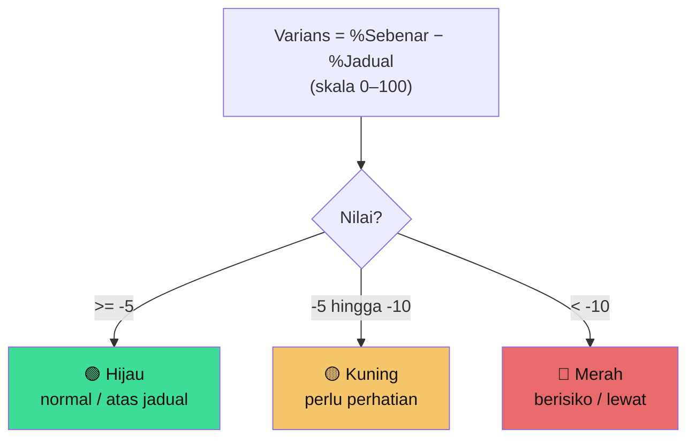
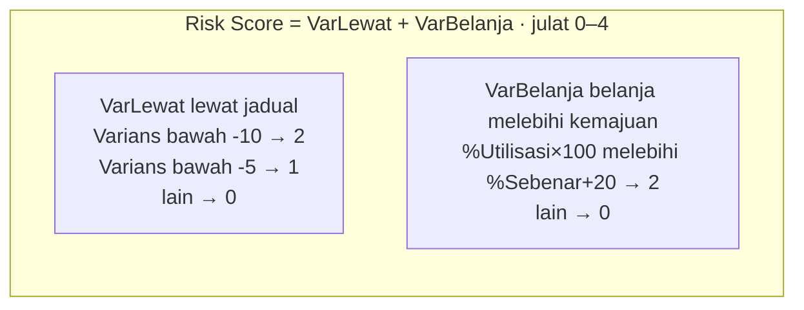

# Hari 3 — Analitik Risiko, Copilot / AI & Capstone

Panduan **hari ketiga** kursus *Visualisasi Data & Dashboard Pintar Berasaskan AI* (kod **BI-FABRIC-KKDW-101**) untuk **KKDW**. Nota ini mengikut **aturcara rasmi SESI 11–15** — lihat [`../JADUAL.md`](../JADUAL.md).

Dua hari lepas kita bina model data (Hari 1) & dashboard 4 halaman (Hari 2). Hari ini kita tukar dashboard kepada **intelligence** — kesan risiko & keutamaan dengan analitik, guna **Copilot/AI** untuk insight, dan lengkapkan **capstone**.

> **Konvensyen bahasa:** Bahasa Melayu untuk penerangan; DAX & istilah teknikal dalam Bahasa Inggeris.

> **Cara guna nota ini:** Konsep di bawah; lab hands-on (DAX salin-tampal) dalam [`snippets/lab.md`](./snippets/lab.md).

---

## Fokus Hari Ini

| Topik | Rujukan rasmi |
|-------|----------------|
| Key Influencers | [learn.microsoft.com/power-bi/visuals/power-bi-visualization-influencers](https://learn.microsoft.com/power-bi/visuals/power-bi-visualization-influencers) |
| Decomposition Tree | [learn.microsoft.com/power-bi/visuals/power-bi-visualization-decomposition-tree](https://learn.microsoft.com/power-bi/visuals/power-bi-visualization-decomposition-tree) |
| Smart Narrative | [learn.microsoft.com/power-bi/visuals/power-bi-visualization-smart-narrative](https://learn.microsoft.com/power-bi/visuals/power-bi-visualization-smart-narrative) |
| Anomaly detection | [learn.microsoft.com/power-bi/visuals/power-bi-visualization-anomaly-detection](https://learn.microsoft.com/power-bi/visuals/power-bi-visualization-anomaly-detection) |
| Copilot dalam Power BI | [learn.microsoft.com/power-bi/create-reports/copilot-introduction](https://learn.microsoft.com/power-bi/create-reports/copilot-introduction) |
| Copilot dalam Fabric | [learn.microsoft.com/fabric/get-started/copilot-fabric-overview](https://learn.microsoft.com/fabric/get-started/copilot-fabric-overview) |

## Jadual Hari Ini — **Jumaat (8.30 pagi – 12.30 tengah hari)**

*(Separuh hari — padat & lebih berfokus demo; kerja lab lanjutan boleh disambung sebagai tugasan susulan. Tamat sebelum solat Jumaat.)*

| Masa | Agenda |
|------|--------|
| 8.30 – 8.45 pagi | Pendaftaran & Sambung Semula (taklimat ringkas) |
| **8.45 – 9.45 pagi** | **SESI 11: Analitik Risiko & Early Warning** — varians jadual vs sebenar · Hijau/Kuning/Merah · 💻 Lab measure varians |
| **9.45 – 10.30 pagi** | **SESI 12: Fizikal vs Kewangan, Risk Score & Priority Index** — under/over-utilisation · Risk Score · Kos/km · Kos/sambungan · 💻 Lab halaman risiko |
| 10.30 – 10.45 pagi | Rehat |
| **10.45 – 11.20 pagi** | **SESI 13: Ciri Analitik AI Terbina** — Key Influencers · Decomposition Tree · Smart Narrative · anomaly · 🔎 Demo |
| **11.20 – 11.55 pagi** | **SESI 14: Copilot / AI** — NL Q&A · naratif · jana DAX · batasan · 💻 Demo + Lab pertanyaan |
| **11.55 – 12.30 tgh** | **Capstone + Demo & Sijil** |
| 12.30 tengah hari | Bersurai (sebelum solat Jumaat) |

**Hasil Hari 3:** Dashboard intelligence lengkap + Copilot/AI + capstone dibentang.

---

## SESI 11 (8.45 – 9.45 pagi) — Analitik Risiko & Early Warning

### Konsep: projek lewat dikesan lebih awal

Data MyProjek ada dua medan kemajuan penting:

- `peratus_jadual_projek` — **% jadual** (sepatutnya sudah siap sebanyak ini)
- `peratus_sebenar_projek` — **% sebenar** (kemajuan fizikal betul)

Bila **sebenar < jadual**, projek **ketinggalan**. Ukuran itu ialah **varians**:

```
Varians = % Sebenar − % Jadual   (negatif = lewat)
```

### Indikator risiko (Hijau/Kuning/Merah)

Mengikut cadangan KKDW:

| Warna | Varians | Maksud |
|-------|---------|--------|
| 🟢 Hijau | 0 hingga −5% | Normal / atas jadual |
| 🟡 Kuning | −5% hingga −10% | Perlu perhatian |
| 🔴 Merah | melebihi −10% | Berisiko / lewat |



### DAX

> **Skala:** `peratus_*` = 0–100 dalam data sebenar → ambang **-5 / -10** (mata peratus).

```dax
Varians Kemajuan =
AVERAGE ( MyProjek[peratus_sebenar_projek] )
    - AVERAGE ( MyProjek[peratus_jadual_projek] )

Status Risiko =
SWITCH (
    TRUE (),
    [Varians Kemajuan] >= -5, "Hijau",
    [Varians Kemajuan] >= -10, "Kuning",
    "Merah"
)
```

Gunakan **Conditional Formatting** (Hari 2) untuk warnakan matriks projek ikut `Status Risiko`.

> 💻 **Lab SESI 11:** [Latihan 11](./snippets/lab.md#latihan-11--measure-varians--risiko).

---

## SESI 12 (9.45 – 10.30 pagi) — Fizikal vs Kewangan, Risk Score & Priority Index

### Kemajuan Fizikal vs Kewangan

Bandingkan **kemajuan fizikal** dengan **kadar belanja** untuk kesan ketidakpadanan:

- **Normal** — fizikal & kewangan bergerak seimbang.
- **Risiko kewangan** — belanja jauh > kemajuan fizikal (contoh: 80% belanja, 50% siap) → perlu semakan.
- **Under-utilisation** — kemajuan fizikal baik tetapi belanja masih rendah.

### Project Risk Score

Gabung beberapa faktor kepada satu skor supaya projek boleh disusun:

```dax
Risk Score =                          -- skala 0–100
VAR VarLewat   = IF ( [Varians Kemajuan] < -10, 2, IF ( [Varians Kemajuan] < -5, 1, 0 ) )
VAR VarBelanja = IF ( [% Utilisasi] * 100 > [Purata Kemajuan Sebenar] + 20, 2, 0 )
RETURN VarLewat + VarBelanja
```



> Skor boleh diperkukuh dengan faktor tambahan: tarikh siap semakin hampir, data kemajuan tidak terkini, status pelaksanaan tertentu.

### Kecekapan: Kos per Unit

```dax
Kos per KM = DIVIDE ( SUM ( JPD[kos_projek] ), SUM ( JPD[panjang_jalan] ) )

Kos per Sambungan = DIVIDE ( SUM ( BELB[kos_projek] ), SUM ( BELB[jumlah_projek_peserta] ) )
```

> **Benchmark indikatif** kos jalan ~RM9–11 juta/km — gunakan hanya sebagai **panduan awal**; ambil kira geografi, skop & keadaan tapak sebelum buat kesimpulan.

### Priority Index

Gabungkan keperluan (kemajuan rendah, penerima manfaat tinggi) dan risiko untuk bantu jawab: *kawasan/projek mana patut diberi keutamaan jika ada tambahan peruntukan?*

> 💻 **Lab SESI 12:** [Latihan 12](./snippets/lab.md#latihan-12--halaman-ai-risk--early-warning) — bina halaman **AI Project Risk & Early Warning**.

---

## SESI 13 (10.45 – 11.20 pagi) — Ciri Analitik AI Terbina dalam Power BI

Power BI ada visual AI **tanpa lesen Copilot** — sesuai bila Copilot belum sedia:

- **Key Influencers** — apa yang paling mempengaruhi sesuatu hasil? Contoh: faktor yang paling menyumbang kepada projek berstatus "Merah".
- **Decomposition Tree** — pecahkan satu nombor (jumlah belanja) mengikut dimensi (negeri → daerah → status) secara interaktif; AI boleh cadang "high value" seterusnya.
- **Smart Narrative** — jana ringkasan teks automatik tentang visual/halaman (dikemas kini bila data berubah).
- **Anomaly detection** — kesan titik luar biasa pada carta *line* (contoh: lonjakan belanja luar norma).
- **Analyze ("Explain the increase/decrease")** — klik kanan titik data yang berubah → AI terangkan **kenapa** (contoh: kenapa belanja satu negeri melonjak).
- **Quick Insights** — dalam Power BI Service, AI imbas seluruh model & cari corak/anomali automatik (usaha hampir sifar).
- **Automatically find clusters** — kumpulkan projek serupa automatik (scatter/jadual) — berguna untuk segmen keutamaan (kos/km vs kemajuan).

> Semua ini **percuma & terbina** (tiada F64 diperlukan) — ia **tidak** berbual bahasa biasa. Copilot (SESI 14) ialah lapisan sembang di atasnya. Butiran & beza penuh: [`../nota/07-copilot-ai.md`](../nota/07-copilot-ai.md).

> 🔎 **Demo + Lab SESI 13:** [Latihan 13](./snippets/lab.md#latihan-13--visual-ai-terbina).

---

## SESI 14 (11.20 – 11.55 pagi) — Copilot / AI sebagai Pegawai Analisis Maya

### Apa Copilot boleh buat

Dalam Power BI & Fabric, **Copilot** membolehkan anda:

- **Tanya data dalam bahasa biasa** (Natural Language Q&A) — tanpa tulis DAX.
- **Jana halaman laporan** automatik daripada arahan.
- **Ringkas naratif** & terangkan insight sesuatu visual.
- **Cadang / tulis measure DAX** daripada penerangan bahasa biasa.

> **Dua peranan:** *pengguna biasa* (pengurusan) guna Copilot untuk **tanya & ringkas**; *pengguna teknikal* (pembina dashboard) guna untuk **auto-jana laporan & tulis DAX**. Copilot juga **menghormati RLS/OLS** — jawapan terhad kepada data yang pengguna dibenarkan lihat. Lihat [`../nota/07-copilot-ai.md`](../nota/07-copilot-ai.md#copilot-untuk-pengguna-biasa-vs-pengguna-teknikal).

### Keperluan lesen (penting)

Copilot perlukan **Fabric capacity (F64+)** atau kapasiti Power BI Premium yang didayakan Copilot. **Sahkan dengan pentadbir IT KKDW** sebelum sesi. Jika belum sedia, gunakan **visual AI terbina (SESI 13)** sebagai ganti — hasil analitik yang serupa.

### Contoh pertanyaan latihan (gaya pengurusan KKDW)

- "Senaraikan 10 projek JPD yang mempunyai jurang terbesar antara kemajuan jadual dan sebenar."
- "Negeri mana mempunyai perbelanjaan BELB tertinggi tetapi kemajuan projek paling rendah?"
- "Ringkaskan prestasi projek BELB untuk Sabah."
- "Apakah tiga isu utama portfolio JPD pada tempoh semasa?"
- "Cari projek yang mempunyai kemajuan fizikal kurang 50% tetapi telah menggunakan lebih 70% peruntukan."

### Amalan terbaik & batasan

> **AI membantu, anda memandu.** Copilot boleh salah atau terlepas konteks. **Sentiasa semak** insight terhadap data sumber sebelum dibawa ke keputusan pengurusan. Jangan kongsi data sensitif ke perkhidmatan AI luar kawalan tanpa kelulusan.

> 💻 **Lab SESI 14:** [Latihan 14](./snippets/lab.md#latihan-14--5-pertanyaan-copilot).

---

## Capstone (11.55 – 12.30 tgh) — KKDW Rural Infrastructure Intelligence Dashboard

### Soalan pengurusan utama

> *"Daripada keseluruhan portfolio JPD dan BELB, projek dan kawasan manakah yang perlu diberi perhatian atau keutamaan oleh pengurusan KKDW, dan mengapa?"*

### Tugasan

Gunakan dashboard **dan** Copilot/AI untuk menjawab soalan di atas dengan **cadangan berpaksikan data**: senaraikan projek/kawasan keutamaan, tunjukkan bukti (varians, risiko, ketidakpadanan kewangan, penerima manfaat), dan cadangkan tindakan.

### Deliverable capstone (`capstone.pbix`)

- Dashboard 5 halaman lengkap (Executive, JPD, BELB, Financial, AI Risk)
- Measures risiko + Priority Index
- Ringkasan eksekutif (Smart Narrative / Copilot)
- Pembentangan ringkas cadangan pengurusan

### Kriteria penilaian

| Kriteria | Wajaran |
|----------|---------|
| Penyediaan & pemodelan data | 20% |
| KPI & measures (DAX) | 20% |
| Reka bentuk dashboard & interaktiviti | 20% |
| Analitik risiko & penggunaan Copilot/AI | 20% |
| Pembentangan & cadangan pengurusan | 20% |

---

## Rumusan Kursus

Dalam 3 hari anda telah lalui **keseluruhan rantaian kerja data**: sediakan & model data (Fabric/Power Query) → bina dashboard (Power BI/DAX) → analitik risiko → insight AI (Copilot). Anda kini boleh menukar data projek luar bandar KKDW kepada **insight yang menyokong keputusan**.

**Langkah seterusnya selepas kursus:**
- [ ] Sambungkan ke sumber data sebenar (bukan Excel) & jadualkan refresh
- [ ] Laksana RLS mengikut dasar capaian KKDW
- [ ] Kembangkan Priority Index dengan faktor tambahan (penerima manfaat, keadaan tapak)
- [ ] Sahkan lesen Fabric/Copilot untuk penggunaan meluas

⬅️ Kembali: [Hari 2](../hari-2/) · 🏠 [Utama](../README.md)
