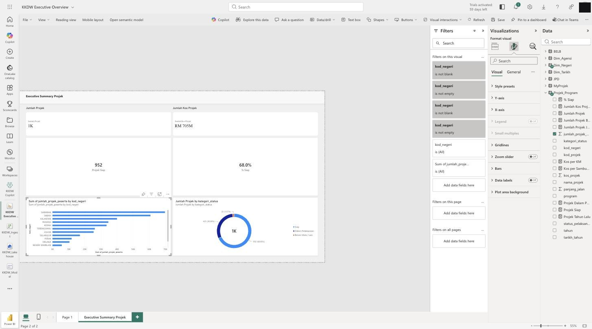
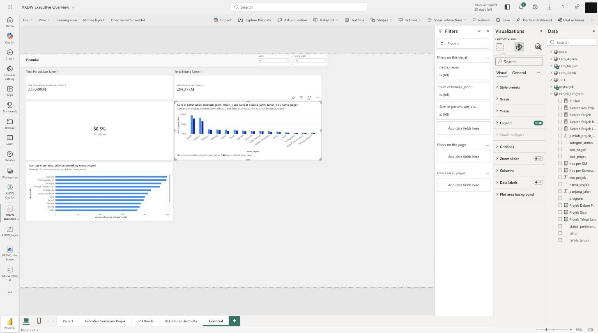

# Hari 3 — Lab Hands-On (SESI 11–14 + Capstone)

Latihan membina **analitik risiko**, **visual AI terbina**, dan **Copilot** — semua dalam **Power BI Service / Fabric (pelayar)**. Mula dari laporan `KKDW_Model` Hari 2 (perubahan auto-simpan; tiada fail `.pbix`); *Save a copy* laporan sebagai **Capstone** untuk demo.

> 📎 **Rujukan kod:** [`risk-measures.dax`](./risk-measures.dax) — Varians, Status Risiko, Risk Score, Kos per KM/Sambungan, Priority Index · [`copilot-prompts.md`](./copilot-prompts.md) — prompt Copilot (Q&A, jana DAX, cipta visual).

---

## Latihan 11 — Measure Varians & Risiko

```dax
Varians Kemajuan =
AVERAGE ( MyProjek[peratus_sebenar_projek] )
    - AVERAGE ( MyProjek[peratus_jadual_projek] )
```
```dax
Status Risiko =
SWITCH (
    TRUE (),
    [Varians Kemajuan] >= -5, "Hijau",
    [Varians Kemajuan] >= -10, "Kuning",
    "Merah"
)
```

1. Buat **Matrix**: *Rows* = `nama_projek`, *Values* = `% Jadual`, `% Sebenar`, `Varians Kemajuan`.
2. **Conditional Formatting** pada `Status Risiko` (atau `Varians Kemajuan`): merah untuk < −10%, kuning −5% hingga −10%, hijau selebihnya.

✅ **Semak:** projek dengan varians besar bertanda merah.

---

## Latihan 12 — Halaman AI Risk & Early Warning

Buat halaman ke-5. Tambah:

1. **KPI cards:** bilangan projek Merah / Kuning / Hijau.
2. **Table:** projek berisiko (`nama_projek`, `kod_negeri`, `% Jadual`, `% Sebenar`, `Varians Kemajuan`, `Belanja`) — ditapis `Status Risiko = "Merah"`.
3. **Measures kecekapan:**
```dax
Kos per KM =
DIVIDE (
    CALCULATE ( SUM ( Projek_Program[kos_projek] ), Projek_Program[program] = "JPD" ),
    CALCULATE ( SUM ( Projek_Program[panjang_jalan] ), Projek_Program[program] = "JPD" )
)
```
```dax
Kos per Sambungan =
DIVIDE (
    CALCULATE ( SUM ( Projek_Program[kos_projek] ), Projek_Program[program] = "BELB" ),
    CALCULATE ( SUM ( Projek_Program[jumlah_projek_peserta] ), Projek_Program[program] = "BELB" )
)
```
4. **Risk Score & Priority (asas):**
```dax
Risk Score =
VAR VarLewat =
    SWITCH ( TRUE (), [Varians Kemajuan] < -10, 2, [Varians Kemajuan] < -5, 1, 0 )
VAR VarBelanja =
    IF ( [% Utilisasi] * 100 > [Purata Kemajuan Sebenar] + 20, 2, 0 )
RETURN VarLewat + VarBelanja
```

✅ **Semak:** halaman menonjolkan projek keutamaan (skor tertinggi).

---

## Latihan 13 — Visual AI Terbina

1. **Key Influencers:** *Analyze* = `Status Risiko`, *Explain by* = `kod_negeri`, `program`, `% Utilisasi`. Baca: apa paling mempengaruhi status "Merah"?
2. **Decomposition Tree:** *Analyze* = `Jumlah Belanja`, *Explain by* = `kod_negeri`, `kod_daerah`, `kategori_status`. Klik buka peringkat.
3. **Smart Narrative:** klik kanan halaman → **Summarize** → letak kotak naratif automatik.
4. **Anomaly detection:** buat *Line chart* belanja ikut tahun → **Analytics → Find anomalies**.

✅ **Semak:** naratif automatik menyebut nombor sebenar KKDW.

> Visual ini **tidak perlukan lesen Copilot** — sesuai jika Copilot belum sedia.

---

## Latihan 14 — 5 Pertanyaan Copilot

> Perlukan **Fabric F64+/Premium Copilot**. Jika tiada, guna **Q&A visual** (percuma): tambah visual **Q&A** dan taip soalan yang sama.
>
> 📎 **Set prompt penuh** (Q&A · **jana DAX** · **cipta visual/halaman** · Smart Narrative · Fabric Copilot): [`copilot-prompts.md`](./copilot-prompts.md).

Buka **Copilot** (Power BI Service / Fabric) dan cuba:

1. "Senaraikan 10 projek JPD dengan jurang terbesar antara kemajuan jadual dan sebenar."
2. "Negeri mana perbelanjaan BELB tertinggi tetapi kemajuan paling rendah?"
3. "Ringkaskan prestasi projek BELB untuk Sabah."
4. "Apakah tiga isu utama portfolio JPD pada tempoh semasa?"
5. "Cari projek dengan kemajuan fizikal < 50% tetapi telah guna > 70% peruntukan."

Untuk setiap jawapan: **catat** sama ada betul, dan **semak** terhadap data/matriks anda.

✅ **Semak:** log 5 pertanyaan + nota pengesahan.

> ⚠️ **AI membantu, anda memandu** — jangan bawa jawapan AI ke keputusan tanpa semak sumber.

### Copilot **menjana halaman dashboard** (bukan sekadar Q&A)

Dalam **Power BI Service (Edit) → Copilot → Create a new report page**, taip arahan visual (lihat [`copilot-prompts.md`](./copilot-prompts.md) §3). Copilot bina kad KPI + carta secara automatik dalam beberapa saat. *(Halaman di bawah dijana sepenuhnya oleh Copilot pada model `KKDW_Model`.)*

*Halaman **Executive Summary** — kad Jumlah Projek · Jumlah Kos · Projek Siap · % Siap + bar ikut negeri + donut ikut `kategori_status`:*


*Halaman **Financial** — Peruntukan 353M · Belanja 284M · **% Utilisasi 80.5%** + peruntukan vs belanja + peratus_sebenar ikut negeri:*


> ⚠️ **Sentiasa semak output Copilot:** ia kadang guna **lajur** (mis. `jumlah_projek_peserta`) dan bukan **measure** yang betul, atau terlepas **penapis** (mis. bar BELB tak ditapis `program = BELB`). Betulkan measure & penapis selepas dijana — inilah maksud *"AI membantu, anda memandu"*.

---

## Capstone — KKDW Rural Infrastructure Intelligence Dashboard

**Soalan:** *Projek dan kawasan manakah yang perlu diberi keutamaan oleh pengurusan KKDW, dan mengapa?*

**Siapkan:**
- [ ] Dashboard 5 halaman (Executive, JPD, BELB, Financial, AI Risk)
- [ ] Measures risiko + Risk Score + Priority
- [ ] Ringkasan eksekutif (Smart Narrative / Copilot)
- [ ] 3–5 cadangan keutamaan **berpaksikan data** (projek + sebab: varians, ketidakpadanan kewangan, penerima manfaat)
- [ ] Laporan Capstone disimpan dalam workspace Fabric (auto-simpan) → **Share** → sedia untuk pembentangan

**Pembentangan (5 min/kumpulan):** tunjuk dashboard, jawab soalan pengurusan, justifikasi keutamaan dengan bukti pada skrin.

---

## 📘 Rujukan Buku

*Architecting Power BI Solutions in Microsoft Fabric* (Packt) — bacaan lanjut bagi topik Hari 3:

| Latihan / topik | Bab & muka surat |
|---|---|
| SESI 13 · **Visual AI terbina** (Decomposition Tree, Analyze, Quick Insights) | Bab 12 *Leveraging Artificial Intelligence in Power BI* (ms 271–288) — Quick Insights ms 272, Analyze ms 273, Decomposition Tree **ms 275** |
| SESI 13 · Clustering & anomaly detection | Bab 14 *Uncovering Features of Power BI for Data Scientists* — clustering ms 323, anomaly detection ms 326 |
| SESI 14 · **Copilot** (pengguna biasa vs teknikal) | Bab 12 — Copilot pengguna biasa **ms 278**, teknikal ms 282 |
| Capstone · tadbir urus & keselamatan | Bab 10 (RLS ms 243) · Bab 15 sensitivity labels ms 336 · Bab 16 *Designing Power BI Governance* ms 357 |

> Nota konsep berkaitan: [`../../nota/06-analitik-risiko.md`](../../nota/06-analitik-risiko.md) · [`../../nota/07-copilot-ai.md`](../../nota/07-copilot-ai.md).
