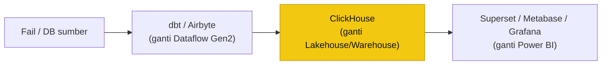

# Nota Rujukan: Alternatif Sumber Terbuka (On-Prem / VM)

> ⚠️ **Bukan stack kursus.** Kursus ini **kekal** pada **Microsoft Fabric · Power BI · Copilot**. Nota ini **rujukan sahaja** — untuk pasukan yang perlu penyelesaian **layan-sendiri (self-hosted)** di on-prem/VM kerana kekangan **lesen, kapasiti, bajet, atau kedaulatan data**. Konsep yang dipelajari (Lakehouse, star schema, SQL/DAX, dashboard) **boleh dipindah** ke stack lain.

## Kenapa pertimbangkan alternatif?

- **Lesen & kapasiti:** Fabric perlu kapasiti **F-SKU berbayar**; Copilot perlu **F64+**. Alternatif sumber terbuka = **tiada lesen per-pengguna**, jalan atas VM/server sedia ada.
- **Kedaulatan data (data sovereignty):** data kekal **on-prem** — relevan untuk data kerajaan sensitif.
- **Tiada throttling kapasiti:** anda kawal CPU/RAM sendiri (elak ralat *"compute capacity exceeded"* / evaluation quota).
- **Kos:** perisian **percuma** (open source); bayar infrastruktur & penyelenggaraan sahaja.

## Peta padanan — Fabric → alternatif sumber terbuka

| Lapisan (Fabric) | Peranan | Alternatif sumber terbuka (on-prem / VM) |
|---|---|---|
| **OneLake / Lakehouse / Warehouse** | Simpan + query data | **ClickHouse** (OLAP columnar, sangat pantas) · DuckDB · PostgreSQL · Delta/Iceberg + **MinIO** (storan S3) |
| **Enjin query / SQL analytics** | SQL merentas data besar | **ClickHouse** · **Trino/Presto** · Apache Doris · DuckDB |
| **Dataflow Gen2 / Power Query** | Transform (ETL/ELT) | **dbt** (transform SQL) · **Airbyte** (ingest) · Apache **Airflow**/Dagster (jadual) · Apache NiFi |
| **Power BI (visualisasi)** | Dashboard & laporan | **Apache Superset** · **Metabase** · **Grafana** · Redash · Lightdash |
| **Copilot / NL Q&A / jana DAX** | AI atas data | LLM sumber terbuka + **text-to-SQL** (Vanna.ai, Dataherald) · Superset/Metabase + LLM |
| **Microsoft Entra (identiti)** | Log masuk / SSO | **Keycloak** |

## ClickHouse — teras alternatif on-prem

**ClickHouse** ialah pangkalan data **OLAP columnar** sumber terbuka — laju untuk agregasi atas berjuta baris (peranan seperti Warehouse / Direct Lake dalam Fabric). Boleh pasang atas **VM / Docker / Kubernetes**, guna **SQL biasa**, dan menyambung terus ke kebanyakan alat visual. Corak lazim self-hosted:

## Alat visual mana paling hampir Power BI?

| Alat | Paling sesuai | Berbanding Power BI |
|---|---|---|
| **Apache Superset** | BI web penuh — carta kaya, SQL Lab, dashboard, RBAC/RLS | **Paling hampir Power BI Service** (authoring web, banyak jenis visual) |
| **Metabase** | Mudah; "ask a question" mesra bukan-teknikal | Macam **Q&A / self-service** Power BI; paling cepat siap |
| **Grafana** | Siri masa, pemantauan, peta | Terbaik untuk ops/real-time; kurang ad-hoc BI |

*Untuk pengalaman paling dekat Power BI (dashboard perniagaan, drill, RLS), **Apache Superset** ialah pilihan utama; **ClickHouse + Superset** ialah gabungan self-hosted paling popular.*

## Batasan / kos tersembunyi

- **Anda urus infra:** pasang, naik taraf, backup, keselamatan, tetapan RLS sendiri (tiada khidmat terurus).
- **Tiada Copilot setara:** NL Q&A / jana DAX gred-Copilot tak wujud siap-pakai; perlu integrasi LLM sendiri.
- **Kepakaran:** perlu kemahiran **SQL/DevOps** lebih tinggi; kurang "no-code" berbanding Power BI.
- **Sokongan:** komuniti — atau langganan komersial (ClickHouse Cloud, **Preset** untuk Superset, **Metabase Pro**, Grafana Cloud).

> **Rumusan:** untuk kursus & majoriti kes KKDW, **Fabric + Power BI** kekal disyorkan (paling cepat, no-code, Copilot). Pertimbang **ClickHouse + Superset** (self-hosted) hanya bila **kedaulatan data on-prem**, **elak lesen/kapasiti**, atau **kawalan infra penuh** jadi keutamaan.
